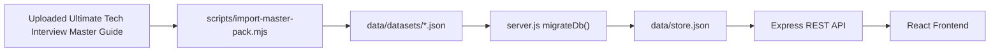

# CrackIT by SJ DEVS

CrackIT by SJ DEVS is a free, self-hostable interview preparation platform for DSA, MCQs, coding challenges, company preparation, HR questions, and career roadmaps.

The project is intentionally content-first: the website is powered by the uploaded **Ultimate Tech Interview Master Guide**, parsed into structured JSON collections under `data/datasets`.

## Current Status

Working now:

- React/Vite frontend at `http://127.0.0.1:5173`
- Express backend at `http://127.0.0.1:4000`
- MongoDB storage adapter when `MONGODB_URI` is configured
- Local JSON fallback database at `data/store.json`
- Parsed dataset collections in `data/datasets`
- Search, filters, pagination, content detail view
- MCQ options, submit, scoring, explanations
- Register/login routes with JWT and bcrypt
- Bookmarks, read tracking, notes, roadmap progress routes
- Company preparation pages
- React Router pages for content, MCQs, companies, projects, Linux, OS, DBMS, admin, achievements, profile, settings
- Dataset-level solved tracking, bookmarking, and notes
- Admin-protected content management API
- Leaderboard route based on user progress

Not connected yet:

- Live MongoDB Atlas credentials in `.env`
- Production Google OAuth credentials in `.env`
- Real code execution sandbox
- Full contest engine

## Dataset

Regenerate the dataset from the uploaded guide:

```powershell
node scripts/import-master-pack.mjs
```

Generated collections:

- `data/datasets/dsa_easy.json`
- `data/datasets/dsa_medium.json`
- `data/datasets/dsa_hard.json`
- `data/datasets/coding_challenges.json`
- `data/datasets/cloud_mcq.json`
- `data/datasets/networking_mcq.json`
- `data/datasets/ai_ml_mcq.json`
- `data/datasets/devops_mcq.json`
- `data/datasets/cybersecurity_mcq.json`
- `data/datasets/hr_questions.json`
- `data/datasets/company_questions.json`

Current imported content:

- 50 Easy DSA
- 75 Medium DSA
- 100 Hard DSA
- 100 Coding Challenges
- 100 Cloud MCQs
- 100 Networking MCQs
- 100 AI/ML MCQs
- 100 DevOps MCQs
- 100 Cybersecurity MCQs
- 50 HR Questions

## Run Locally

Fastest option, one terminal:

```powershell
cd "C:\Users\sujan\OneDrive\Desktop\sj devs"
node scripts/import-master-pack.mjs
npm.cmd run start:local
```

This starts both:

- Frontend: `http://127.0.0.1:5173`
- Backend: `http://127.0.0.1:4000`

Manual option, two terminals.

Terminal 1, backend:

```powershell
cd "C:\Users\sujan\OneDrive\Desktop\sj devs"
node scripts/import-master-pack.mjs
npm.cmd run api
```

Terminal 2, frontend:

```powershell
cd "C:\Users\sujan\OneDrive\Desktop\sj devs"
npm.cmd run dev -- --port 5173
```

Open the app:

```text
http://127.0.0.1:5173
```

Check backend health:

```text
http://127.0.0.1:4000/api/status
```

Run the local technical audit:

```powershell
npm.cmd run audit:status
```

Run the authentication-only audit:

```powershell
npm.cmd run audit:auth
```

Do not open `http://127.0.0.1:4000` directly and expect the website. Port `4000` is API-only, so the root path may show `Cannot GET /`.

## Important API Routes

Content:

- `GET /api/status`
- `GET /api/datasets/status`
- `GET /api/content`
- `GET /api/content/:id`
- `POST /api/content/:id/read`
- `POST /api/content/:id/solved`
- `POST /api/content/:id/bookmark`
- `POST /api/content/:id/notes`

MCQs:

- `GET /api/mcqs`
- `GET /api/mcqs/:id`
- `POST /api/mcqs/submit`

Questions and notes:

- `GET /api/questions`
- `POST /api/questions/:id/solved`
- `POST /api/questions/:id/bookmark`
- `POST /api/questions/:id/notes`

Roadmaps:

- `GET /api/roadmaps`
- `POST /api/roadmaps/:id/steps`

Companies:

- `GET /api/companies`
- `GET /api/companies/:id`

Auth:

- `POST /api/auth/register`
- `POST /api/auth/login`
- `POST /api/auth/refresh`
- `POST /api/auth/logout`
- `GET /api/auth/google/url`
- `GET /api/auth/google/callback`
- `GET /api/auth/username-suggestions`
- `POST /api/auth/forgot-password`
- `POST /api/auth/reset-password`

Leaderboard:

- `GET /api/leaderboard`

Admin:

- `GET /api/admin/overview`
- `POST /api/admin/content`
- `PATCH /api/admin/content/:id`
- `DELETE /api/admin/content/:id`

## Search And Filters

The content API supports:

- `search`
- `category`
- `difficulty`
- `topic`
- `company`
- `type`
- `page`
- `limit`

Example:

```text
http://127.0.0.1:4000/api/content?page=1&limit=25&type=DSA&difficulty=Easy&company=Amazon
```

## Architecture



## Environment Variables

Optional for local development:

```text
FRONTEND_URL=http://127.0.0.1:5173
API_URL=http://127.0.0.1:4000
GOOGLE_CLIENT_ID=
GOOGLE_CLIENT_SECRET=
MONGODB_URI=
MONGODB_DB_NAME=crackit
ADMIN_EMAILS=admin@example.com
COOKIE_SECURE=false
CORS_ORIGINS=http://127.0.0.1:5173,http://localhost:5173
VITE_API_URL=http://127.0.0.1:4000/api
```

Current behavior:

- If `GOOGLE_CLIENT_ID` and `GOOGLE_CLIENT_SECRET` are empty, Google OAuth cannot complete.
- If `MONGODB_URI` is empty, `/api/status` reports `mongoConfigured: false`.
- The app still works locally using `data/store.json`.
- Admin CMS routes require the logged-in user's email to be listed in `ADMIN_EMAILS`.
- Set `COOKIE_SECURE=true` only when serving over HTTPS.

## MongoDB Setup

The backend now supports MongoDB through the official `mongodb` driver. If `MONGODB_URI` is present, the server loads these collections and creates indexes. If it is absent, the app uses `data/store.json` so local development still works.

Collections:

- `users`
- `contentItems`
- `mcqs`
- `questions`
- `contentProgress`
- `progress`
- `notes`
- `roadmapProgress`
- `mcqResults`
- `companies`

Indexes created by the backend include:

- `contentItems.type`
- `contentItems.difficulty`
- `contentItems.category`
- `contentItems.topicTags`
- `contentItems.companyTags`
- `users.email`
- `users.username`
- `contentProgress.userId`
- `progress.userId`
- `mcqResults.userId`

Set `MONGODB_STRICT=true` only when production must fail fast if Atlas is unavailable.

## Development Priorities

1. Add real MongoDB Atlas URI and verify `/api/status` reports `mongoConnected: true`
2. Add Google OAuth credentials and verify browser sign-in
3. Add real source data for Linux, OS, DBMS, and project implementation pages
4. Improve MCQ timed quiz modes
5. Build contest engine
6. Add code editor and secure execution sandbox
7. Production deployment

## Reference Notice

CrackIT is designed as a learning and reference resource. While it provides curated technical content, interview topics, and career guidance, users should not rely entirely on this platform. Always verify information, build practical projects, explore official documentation, and use this website as a supplementary learning resource.
